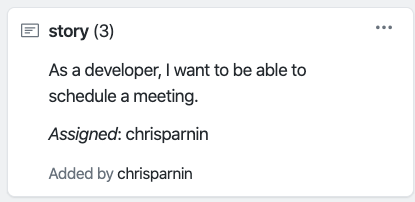

# Milestone: PROCESS

For this milestone, you will be working on implementing your use cases and applying software processes and practices.

For each use case, you must implement the basic flow described by the use case. You will have a chance to continuing polishing the bot in your next milestone in order to handle edge cases and streamline interaction. It is more important that you try implementing a minimal proof of concept (that covers all use cases) rather than a perfect version of your bot (for only one use case).

### Process

Building software is a complex process and you will have a big team of people. The only way you will make it through this process is by careful planning and delegation of work.

You will be develop your software in two short iterations:

* Wed Oct 23-- Fri Nov 1
* Sat Nov 2--Fri Nov 8th

At the beginning of a iteration, you will:

* Divide your use cases into stories/tasks. 
* Assign your story points (1,3,5,8) a user story
* Assign a developer, who is committed to complete the story by the end of the iteration.

To track work, all teams will use the kanban board (Github Project). If you're using a "note", indicate the story points and assigned developer as following:

You may find the [SMART](https://www.mindtools.com/pages/article/smart-goals.htm) method a good way plan tasks.

### Practices

For your software process, follow a "scrumban" methodology, that is a blend of kanban and scrum practices. 

Furthermore, identify at least one core practice and collary practice not already part of your software process. Integrate those practices in your software development.

Keep meeting notes and documentation of following these practices and include in your submission.

### Consistency

Work must be equally divided among the team. Furthermore, the work should be completed uniformly.

Creating tasks on the last day of submission **will not receive credit**. Completing a story on the last day of an iteration will not (generally) receive credit. Teams with uneven contributions, will not receive credit.

Plan ahead.

### TA Demo

You must demonstrate your completed use cases with a TA before the final deadline. Plan ahead.

### Evalution

* Process (25%)
* Practices (25%)
* Consistency (25%)
* TA Demo (25%)

### Submission

Due Friday, Nov 8th before midnight.

Create a markdown file, PROCESS.md, which provides the necessary documentation to describe how your team followed your process.

In your markdown, include:

* Documentation on story creation and assignment at EACH iteration (one option is to include screenshots of kanban board).
* Any scrum meeting notes/process notes
* Include documentation of EACH iteration end. Include status of completed and incomplete tasks, and a process reflection.
